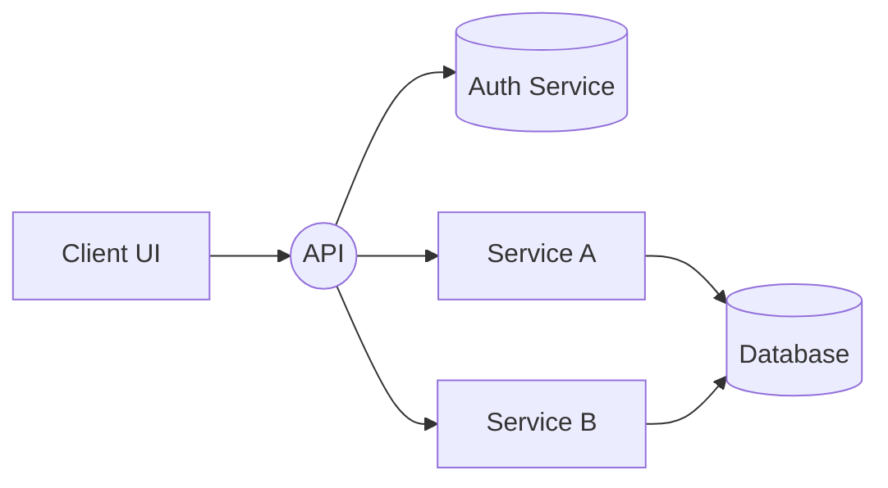
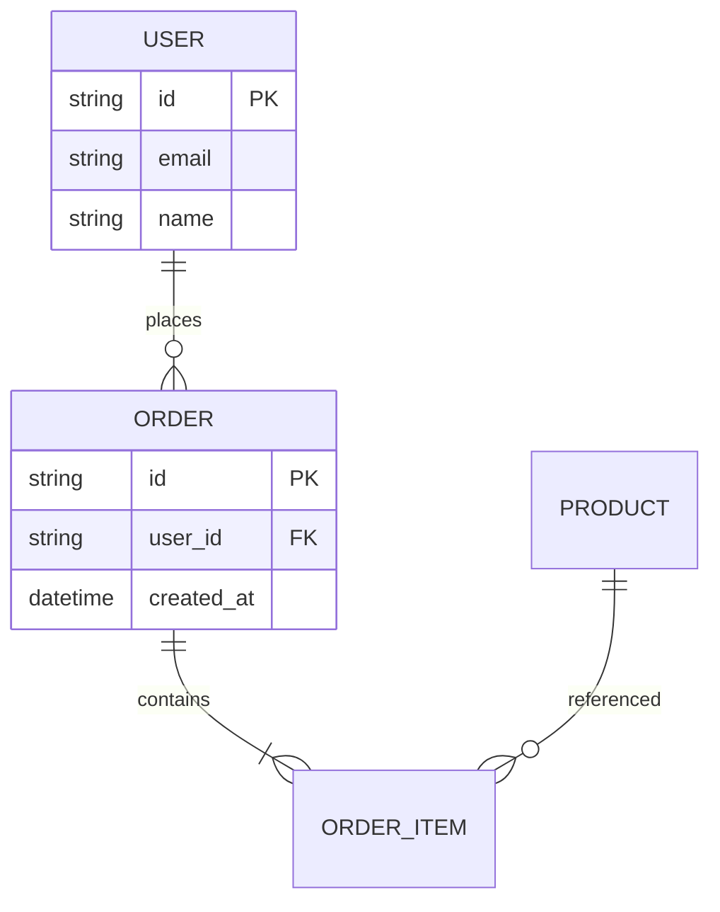

# Visual Features Guide

## Overview

This guide covers the new visual productivity features added to enhance the Notion-like workspace with powerful visualization and task management capabilities.

## New Blocks

### 1. Mermaid Diagrams 🔷

Create flowcharts, ER diagrams, sequence diagrams, class diagrams, and more.

**Insert Command:** `/mermaid`, `/diagram`, `/flowchart`, `/architecture`, `/erd`

**Features:**

- **Edit/Preview Mode:** Click "Edit" to modify diagram code, "Preview" to render
- **Theme Support:** Choose from default, dark, or neutral themes
- **Width Control:** Adjust diagram width (30-100%) with slider
- **Multiple Diagram Types:**
  - Flowcharts (TD, LR, BT, RL)
  - Entity Relationship Diagrams (ER)
  - Sequence Diagrams
  - Class Diagrams
  - State Diagrams
  - Gantt Charts

**Example - Software Architecture:**



**Example - ER Diagram:**



### 2. Charts 📊

Visualize data with bar, line, and pie charts.

**Insert Command:** `/chart`, `/bar`, `/line`, `/pie`, `/graph`

**Features:**

- **Chart Types:** Switch between bar, line, and pie charts
- **Data Editor:** Edit chart data as JSON
- **Size Controls:**
  - Width: 30-100% (slider)
  - Height: 200-600px (slider)
- **Color-Coded Data:**
  - Income: Green (#22c55e)
  - Expenses: Red (#ef4444)
- **Responsive:** Charts auto-resize

**Default Data Structure:**

```json
{
  "labels": ["Jan", "Feb", "Mar", "Apr"],
  "datasets": [
    {
      "label": "Income",
      "data": [1200, 1500, 1100, 1800],
      "backgroundColor": "rgba(34,197,94,0.7)",
      "borderColor": "rgb(34,197,94)"
    },
    {
      "label": "Expenses",
      "data": [800, 1000, 900, 1200],
      "backgroundColor": "rgba(239,68,68,0.7)",
      "borderColor": "rgb(239,68,68)"
    }
  ]
}
```

### 3. Kanban Board 🗂️

Trello/Jira-style task management.

**Insert Command:** `/kanban`, `/board`, `/task`, `/trello`, `/jira`

**Features:**

- **Drag & Drop:** Move cards between columns
- **Add Columns:** Click "Add Column" button
- **Add Cards:** Click "+ Card" in any column
- **Scale Control:** Zoom board (60-100%)
- **Default Columns:**
  - Backlog (slate)
  - In Progress (blue)
  - Review (amber)
  - Done (green)
- **Remove Cards:** Click ✕ on any card

**Workflow:**

1. Add new columns for your workflow
2. Create cards with titles
3. Drag cards through stages
4. Track progress visually

## New Templates

### 1. Financial Dashboard 💹

Pre-configured income vs expenses chart with monthly tracking.

**Features:**

- Green income bars
- Red expense bars
- 6-month default view
- Ready for customization

### 2. Software Architecture 🏗️

System architecture diagram with Mermaid flowchart.

**Use Cases:**

- High-level system design
- Microservices architecture
- Component relationships
- Data flow documentation

### 3. Relational Database 🗄️

ER diagram for database design.

**Use Cases:**

- Schema design
- Table relationships
- Foreign key documentation
- Data modeling

### 4. Task Board (Kanban) 🗂️

Full Kanban board with default workflow.

**Use Cases:**

- Sprint planning
- Team collaboration
- Personal task tracking
- Project management

## Usage Tips

### Mermaid Diagrams

1. Start with a template or existing code
2. Click "Edit" to modify
3. Press Enter or click outside to render
4. Adjust width for readability
5. Use dark theme for better contrast

**Common Patterns:**

- `flowchart TD` - Top to bottom
- `flowchart LR` - Left to right
- `erDiagram` - Entity relationships
- `sequenceDiagram` - Interaction flows

### Charts

1. Insert default chart
2. Click "Edit Data" to customize
3. Modify JSON: labels, datasets, colors
4. Adjust width/height for best fit
5. Switch chart type based on data

**Best Practices:**

- Use green for positive metrics (income, profit, growth)
- Use red for negative metrics (expenses, losses, issues)
- Keep labels short and clear
- Limit datasets to 2-3 for readability

### Kanban Boards

1. Customize columns for your workflow
2. Add cards as tasks come in
3. Drag cards to update status
4. Use scale to fit more columns
5. Delete completed cards or keep for reference

**Team Workflows:**

- Development: Backlog → In Progress → Code Review → Testing → Done
- Design: Ideas → Wireframe → Design → Review → Approved
- Content: Research → Draft → Edit → Review → Published

## Keyboard Shortcuts

- `/` - Open slash menu
- Type block name to filter
- Arrow keys to navigate menu
- Enter to insert block

## Technical Details

### Block Implementation

All blocks use BlockNote's `createReactBlockSpec` with:

- `contentEditable={false}` to prevent editor conflicts
- Props stored in block.props for persistence
- Auto-save through existing DB flow

### Data Persistence

- All block data saved to SQLite
- Changes auto-save after 1 second
- Supports undo/redo
- Templates store block configurations

### Libraries Used

- **Mermaid:** Diagram rendering
- **Chart.js:** Chart visualization
- **react-chartjs-2:** React wrapper for Chart.js
- **HTML5 Drag & Drop:** Kanban functionality

## Next Steps & Enhancements

### Short-term (Phase 2)

- [ ] Add card descriptions and due dates to Kanban
- [ ] Chart templates for common business metrics
- [ ] More Mermaid themes and styling options
- [ ] Export diagrams as PNG/SVG
- [ ] Kanban filters and search

### Medium-term (Phase 3)

- [ ] React Flow integration for interactive diagrams
- [ ] Data binding (connect charts to workspace data)
- [ ] Gantt charts for project timelines
- [ ] Kanban swimlanes and sprint view
- [ ] Advanced chart types (scatter, radar, bubble)

### Long-term (Phase 4)

- [ ] Real-time collaboration on boards
- [ ] Chart animation and interactivity
- [ ] Custom block builder
- [ ] Template marketplace
- [ ] Mobile optimization

## Troubleshooting

### Mermaid not rendering

- Check syntax in edit mode
- Look for error message below diagram
- Verify theme compatibility
- Try simpler diagram first

### Charts not displaying

- Validate JSON structure in edit mode
- Ensure labels and data arrays match length
- Check console for Chart.js errors
- Reduce dataset size if performance issues

### Kanban drag not working

- Ensure browser supports drag & drop
- Check if cards are marked as draggable
- Try scaling board to 100%
- Refresh page if state gets stuck

## Examples & Resources

### Mermaid Documentation

- [Official Mermaid Docs](https://mermaid.js.org/)
- [Live Editor](https://mermaid.live/)
- [Syntax Reference](https://mermaid.js.org/intro/)

### Chart.js Documentation

- [Official Chart.js Docs](https://www.chartjs.org/)
- [Samples Gallery](https://www.chartjs.org/samples/)
- [Configuration Guide](https://www.chartjs.org/docs/latest/configuration/)

### Task Management Best Practices

- [Kanban Guide](https://www.atlassian.com/agile/kanban)
- [Task Workflow Design](https://asana.com/resources/kanban-board)

## Contributing

Found a bug or have a feature request? Open an issue on GitHub with:

- Block type (Mermaid/Chart/Kanban)
- Expected behavior
- Actual behavior
- Steps to reproduce
- Screenshots if applicable

---

**Last Updated:** January 8, 2026
**Version:** 1.0.0
